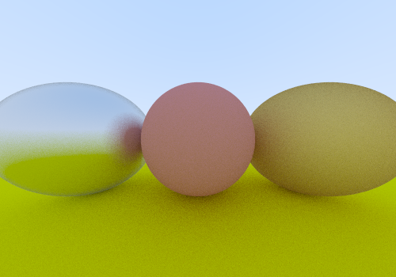
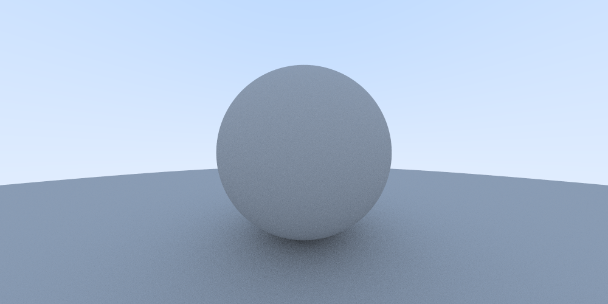
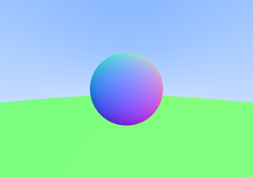

# Building:

First, compile the renderer code by running
```
cargo build --release
```
from the renderer folder.  This will require the wasm32-unknown-unknown target installed.  You can use Rustup to get add it.

All the source is static files so any dev server should work.  I have a simple caddy file so if you have caddy 2.0 installed than from the root folder run:
```
caddy start
```
Then visit <https://localhost/> in your web browser.

I also intend to have a hosted version on github pages.
TODO: insert github pages link

# Output:
Images generated:
Metalics:



Diffuse:



Normals:



# Source:
I'm following the tutorial here: <https://raytracing.github.io/books/RayTracingInOneWeekend.html>